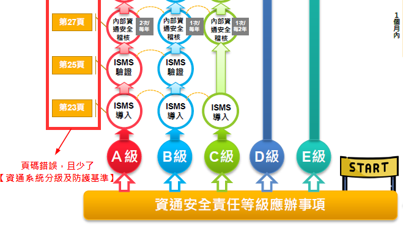
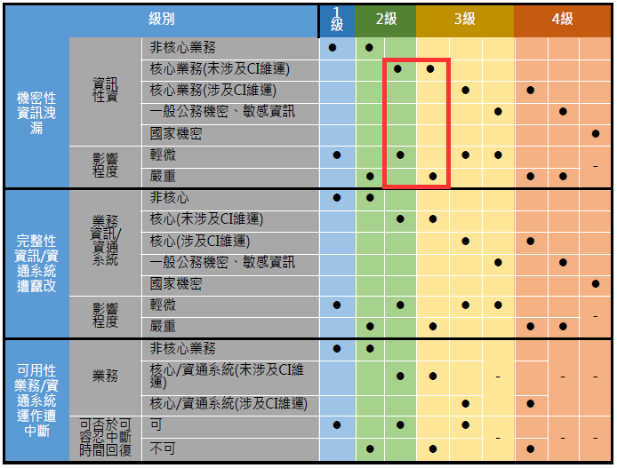

| 單位                     | 姓名   | 職稱       | 回收狀況 |
| ------------------------ | ------ | ---------- | -------- |
| 經濟部資訊中心           | 馬正維 | 主任       | 6/4回收  |
| 財政部資訊中心           | 陳泉錫 | 主任       | 6/11回收 |
| 行政院主計總處           | 潘城武 | 處長       | 6/11回收 |
| 國家發展委員會資訊管理處 | 楊蘭堯 | 高級分析師 |          |
| 行政院資通安全處         | 簡宏偉 | 處長       |          |

# 懶人包簡易版 (Antonius + Reviewers)

### 前言

- **相對於** 資通訊技術的不斷創新演進及新興技術發展，資訊安全之控管 **往往捉襟見肘**，無法跟上**此** ~~資訊科技~~ 快速發展腳步，致使組織或企業核心系統、敏感資料及重要資訊易受到 ~~傳統與新穎~~ 資訊安全威脅。民國 105 年國家安全會議與行政院共同召開「資安即國安策略會議」，會中討論之「資安即國安機制與策略」、「國家層級資安團隊發展策略」及「國防資安產業發展策略」等三大主題 ~~明著~~ 顯示政府全力支持發展國安及產業兼具的資安政策。為積極推動我國資通安全政策及加速建構環境以保障我國資安，總統府於民國 107 年 6 月 6 日公告《資通安全管理法》**，此法** 係屬我國重要法律改革，~~並且~~ **讓** 政府 ~~此刻正大力~~ **落實** ~~執行~~ 國家 ~~推動~~ 資安防護策略**的同時**，**也為** ~~對~~ 我國資安產業 **帶來** ~~而言是~~ 嶄新的營運商機。
- **經濟部工業局 **為順應《資通安全管理法》~~要求~~ **下** 之資安趨勢，**委託工業技術研究院（工研院）** 研析我國《資通安全管理法》之相關推動發展策略與規劃。工研院與電信技術中心**合作提供此《資通安全管理法》採購指引懶人包，**~~以促進~~ **讓** 資安服務/產品需求方獲取整合性資訊，**並建立** ~~及積極建立~~ 資安服務/產品業與需求市場交流管道。~~並且~~ **此《資通安全管理法》採購指引懶人包將** 配合 ~~舉辦~~ 資安產業交流主題媒合活動以創造資安產業與需求方互動機會，加速推動資安服務/產品領域產業商機媒合。

### 導讀

| 單位                     | 姓名   | 職稱       | 滿意度         | 建議                                                         |
| ------------------------ | ------ | ---------- | -------------- | ------------------------------------------------------------ |
| 經濟部資訊中心           | 馬正維 | 主任       | :cloud:        | 建議由上往下（倒置）較順                                     |
| 財政部資訊中心           | 陳泉錫 | 主任       | :sunny::sunny: | - 導讀起始點應從左上角開始 - p5. 右下側圖示，所指時間，72小時等未說明是系統回復時間 |
| 行政院主計總處           | 潘城武 | 處長       | :sunny::sunny: | :heavy_minus_sign: 分級需能清楚辨別, 可舉例                  |
| 國家發展委員會資訊管理處 | 楊蘭堯 | 高級分析師 |                |                                                              |
| 行政院資通安全處         | 簡宏偉 | 處長       |                |                                                              |

- **Bugs**. 應辦事項所對應的頁認有誤，且有應辦事項遺漏，如下圖所示；須確定沒有其它應辦事項也遺漏。
  
  
  
- **STEP 1 資安責任等級**
  
  - ~~可依據以下步驟協助判定資通安全責任等級~~ &rarr; **您首先須要判定貴單位之資通安全責任等級**
  - **Figure**. A級由左上開始到左下，而後 B級由中下到中上，C、D、E級由右上到右下。
  
- **STEP 2 應報事項**
  
  - ~~各資通安全責任等級機關可使用以下 step-by-step 大富翁遊戲查閱《資通安全管理法》採購
    指引懶人包~~ &rarr; **再依您的責任等級一步一步完成資安待辦事項**
  
  - **Darking Colors**. 可用**深淺**來區分不同的**應辦事項類別**，如管理面及技術面的各類別，**愈深**表示資安強度愈強。
  
    

- **STEP 3 事件處理**

  

### 入門

| 單位                     | 姓名   | 職稱       | 滿意度                | 建議                                                         |
| ------------------------ | ------ | ---------- | --------------------- | ------------------------------------------------------------ |
| 經濟部資訊中心           | 馬正維 | 主任       | :cloud:               | :heavy_minus_sign: 特定非公務機關資通安全維護計畫實施情形稽核 &rarr;非必要。 :heavy_minus_sign: ​資通安全責任等級分級辦法 &rarr; 與導讀重覆 |
| 財政部資訊中心           | 陳泉錫 | 主任       | :sunny::sunny::sunny: | :heavy_plus_sign: 資安事件分級表不易了解                     |
| 行政院主計總處           | 潘城武 | 處長       | :umbrella:            | :heavy_minus_sign: 2.2 角色與權責  &rarr;**可更表達讓人易懂** :heavy_minus_sign: 2.3 資通安全維護計畫介紹 &rarr; **要淺顯易懂** :heavy_minus_sign: 2.4 資安事件注意事項 &rarr; **簡捷些** :heavy_minus_sign:  2.5 特定非公務機關資通安全維護計畫實施情形稽核 &rarr; **更意象化些** :heavy_minus_sign: 2.6 資通安全責任等級分級辦法 &rarr; **簡捷些** |
| 國家發展委員會資訊管理處 | 楊蘭堯 | 高級分析師 |                       |                                                              |
| 行政院資通安全處         | 簡宏偉 | 處長       |                       |                                                              |

- 2.1 資通安全管理法架構 

  - **Misleading**.  原圖可能「誤導」特定非公預機關「不必」有資通安全維護計畫及其它工作，但事實上全部都要做。下圖的黑線為直覺的分界，但它可能誤導。

    

  - **Possible Improvement**. 可如下**加入箭頭**，即可避免上述誤導，另外資安等級分級辦法（懶人圖）為資安法第七條之延伸，但卻在維護計畫中之重要應辦事項，也許可能下圖加上此重要關連。

  

- 2.2 資通安全管理法角色與權責

  **【角色與權責可更表達讓人易懂  (潘城武處長)】**

  - **Suggestion 1**. 原圖只有**角色**，沒有提到**權責**，下右圖可能會更好；且下右圖有提到【資通安全維護計畫】、【資安事件通報及應變機制】，**立即銜接**後面章節。

    

  - **Suggestion 2**. 建議各給一些實例

    - 如 中華電信 (特定非公務機關) --> 工業局 (中央目的事業主管機關) --> 行政院 (主管機關)

- 2.3 資通安全維護計畫介紹

  **【要淺顯易懂  (潘城武處長)】**

  - **【資通安全維護計畫】與【資安應辦事項】之關係.** 
    - 完成懶人圖是否即完成100%的【資通安全維護計畫】? 
    - 還是僅完成部份【資通安全維護計畫】? 還有那些沒有在【資安應辦事項】中?

- 2.4 資安事件注意事項

  **【資安事件分級表不易了解 (陳泉錫主任)】** **【簡捷些 (潘城武處長)】**

  - **Reasoning 1**. 

    - 分級表同一項目會因影響嚴重性或時效而**跨級別**，以下圖為例核心業務未及**CI (關鍵基礎設施)**，在輕微程度為2級，但在嚴重程度會被提昇為3級。但第一眼看此圖時，可能會無法馬上理解。

    

  - **Reasoning 2**. 

    - CI未作解釋 - 關鍵基礎設施 **[Critical Infrastructure]** - 八類：能源、水資源、通訊傳播、交通、銀行與金融、. 緊急救援與醫院、重要政府機關、高科技園區。也許可以用下圖加註。

    

  - **Suggestion**. 建議加入一量表（下左圖），可單獨或挑配原圖使用。

    

  - **置入導讀**. 而該量表也可置入懶人圖中，如下意示圖（按馬主任建議 - 上為入口）

    

- 2.5 特定非公務機關資通安全維護計畫實施情形稽核

  **【更意象化些 (潘城武處長)】**

  - 

  

- 2.6 資通安全責任等級分級辦法 :scissors:

  【馬主任建議可以拿掉，因與懶人圖相同】

### 採購指引懶人包綜整

| 單位                     | 姓名   | 職稱       | 滿意度         | 建議                                    |
| ------------------------ | ------ | ---------- | -------------- | --------------------------------------- |
| 經濟部資訊中心           | 馬正維 | 主任       | :cloud:        | :heavy_minus_sign: 本節用途不明確，刪減 |
| 財政部資訊中心           | 陳泉錫 | 主任       | :sunny::sunny: |                                         |
| 行政院主計總處           | 潘城武 | 處長       | :umbrella:     | :heavy_minus_sign: 簡捷些,要分流        |
| 國家發展委員會資訊管理處 | 楊蘭堯 | 高級分析師 |                |                                         |
| 行政院資通安全處         | 簡宏偉 | 處長       |                |                                         |

### 採購指引懶人包

| 單位                     | 姓名   | 職稱       | 滿意度                | 建議                                                         |
| ------------------------ | ------ | ---------- | --------------------- | ------------------------------------------------------------ |
| 經濟部資訊中心           | 馬正維 | 主任       | :sunny:               | :heavy_plus_sign: 建議增述**一般採購案之辦理模式**，可將管理面、技術面及認知訓練面等合併於一案中辦理 :heavy_plus_sign: 另應強調未列入建議廠商名單中，並不表示其未具提供該項服之能力 :heavy_minus_sign: 管理面、技術面、認知訓練面：內容建議再精簡 |
| 財政部資訊中心           | 陳泉錫 | 主任       | :sunny::sunny::sunny: | :heavy_plus_sign: **p46 防毒軟體**. 未提供可信賴之防毒軟體(廠商)，而是提供資安顧問公司名單，似乎與標題未合 :heavy_plus_sign: **p52 APT實做建議**. 似過於抽象，缺少具體可用於要求機關人員遵循之作法 |
| 行政院主計總處           | 潘城武 | 處長       | :cloud:               | :heavy_minus_sign: 簡捷些,要分流                             |
| 國家發展委員會資訊管理處 | 楊蘭堯 | 高級分析師 |                       |                                                              |
| 行政院資通安全處         | 簡宏偉 | 處長       |                       |                                                              |

### 推動資安專欄

| 單位                     | 姓名   | 職稱       | 滿意度                | 建議                             |
| ------------------------ | ------ | ---------- | --------------------- | -------------------------------- |
| 經濟部資訊中心           | 馬正維 | 主任       | :umbrella::umbrella:  | :heavy_minus_sign:目的不具體     |
| 財政部資訊中心           | 陳泉錫 | 主任       | :sunny::sunny::sunny: |                                  |
| 國家發展委員會資訊管理處 | 潘國才 | 處長       | :umbrella::umbrella:  | :heavy_minus_sign: 簡捷些,要分流 |
| 國家發展委員會資訊管理處 | 楊蘭堯 | 高級分析師 |                       |                                  |
| 行政院資通安全處         | 簡宏偉 | 處長       |                       |                                  |

### 採購指引懶人包附錄

| 單位                     | 姓名   | 職稱       | 滿意度                       | 建議 |
| ------------------------ | ------ | ---------- | ---------------------------- | ---- |
| 經濟部資訊中心           | 馬正維 | 主任       | :sunny:                      |      |
| 財政部資訊中心           | 陳泉錫 | 主任       | :sunny::sunny::sunny::sunny: |      |
| 行政院主計總處           | 潘城武 | 處長       | :cloud:                      |      |
| 國家發展委員會資訊管理處 | 楊蘭堯 | 高級分析師 |                              |      |
| 行政院資通安全處         | 簡宏偉 | 處長       |                              |      |